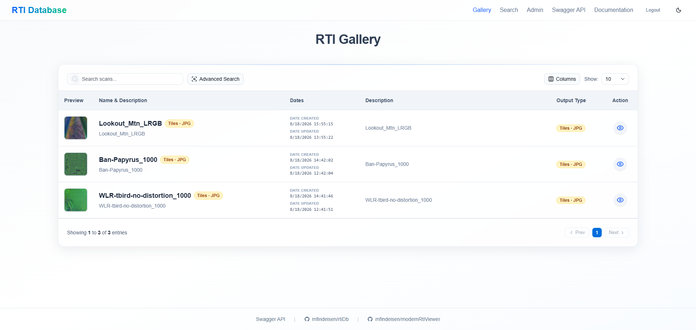
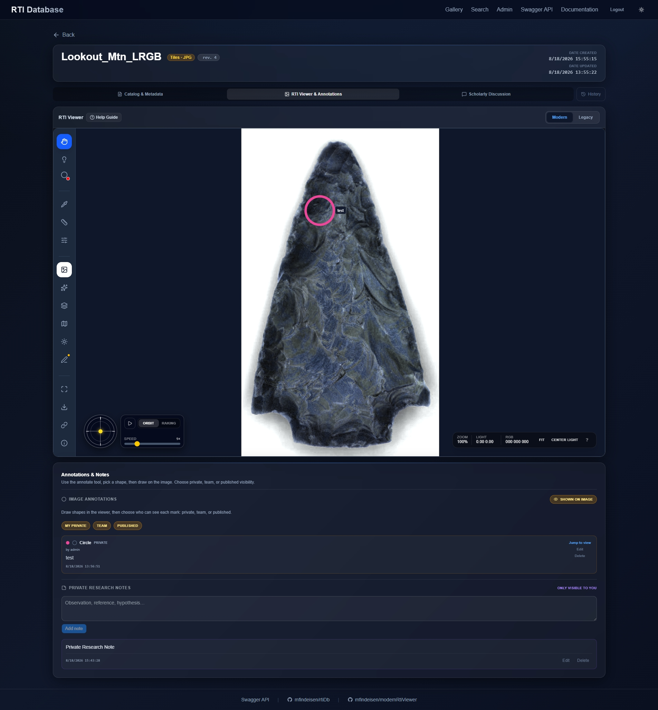
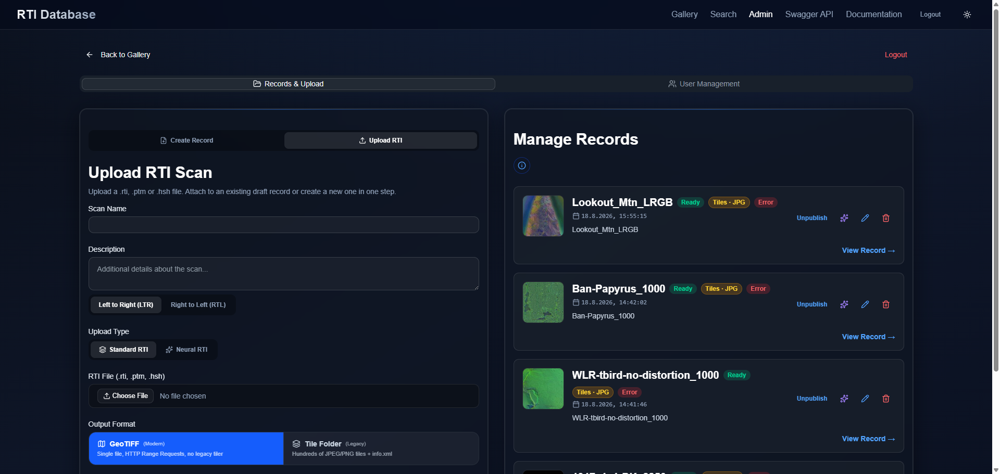
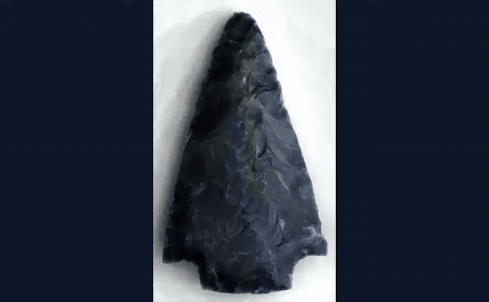

# RTI Database (rtiDb)

A full-stack web application for uploading, processing, cataloging, and viewing Reflectance Transformation Imaging (RTI) datasets.

The platform is a modern archive and viewer for archaeological and scientific RTI data (PTM, HSH, and Neural RTI). It converts large monolithic source files into web-friendly, streamable multi-resolution image pyramids, then serves them through a catalog with searchable metadata, annotations, and an embedded WebGL viewer.

## Screenshots

Gallery, record viewer, and admin upload — plus a short orbit-lighting clip of the viewer (loops in the README).

### Gallery



### RTI Viewer & Annotations



### Admin — Records & Upload



### Viewer demo



Sample datasets shown in these screenshots are credited under [Acknowledgements](#acknowledgements).

## Features

- **Public gallery** of published records with configurable catalog views, column picker, and pagination
- **Configurable catalog types** with custom metadata schemas (text, date, GPS, select, color, URL)
- **Site branding** (name, tagline, logo, favicon, brand colors) and locale date/time formats
- **JWT sessions** in httpOnly cookies, with roles (`admin`, `editor`, `researcher`) and fine-grained permissions
- **Upload & processing** of `.rti` / `.ptm` / `.hsh` (or Neural RTI latent map + decoder weights) into JPEG/PNG/WebP tile pyramids or pyramidal GeoTIFF
- **Live progress** via Server-Sent Events while `rtiprep` tiles gigabyte-scale files
- **Embedded [modernRtiViewer](https://github.com/mfindeisen/modernRtiViewer)** Web Component (PTM, HSH, Neural RTI; pan/zoom, lighting, annotations, scale)
- **Collaboration:** viewer annotations (private / team / published), threaded comments, private notes, revision history
- **Advanced search:** full-text, metadata filters, GPS map / bounding box, CLIP image similarity
- **Exports:** JSON, XML, CSV, BibTeX, RIS, IIIF
- **OpenAPI / Swagger** at `/api/docs` (login required)

## Architecture & Tech Stack

A pnpm workspace with three packages, containerized via Docker:

| Package | Role |
|---|---|
| `client` | Vue 3 + Vite frontend |
| `server` | Express 5 API, processing pipeline, SQLite |
| `packages/shared` | Shared TypeScript types, catalog schema, permissions, auth helpers |

`rtiprep` and `modernRtiViewer` are git submodules under `deps/` and are built automatically.

### Client (frontend)

- **Framework:** Vue 3 + Vite + TypeScript + Vue Router
- **UI:** [shadcn-vue](https://www.shadcn-vue.com/) on [Reka UI](https://reka-ui.com/) primitives, [Lucide](https://lucide.dev/) icons
- **Styling:** Tailwind CSS 4
- **Viewer:** custom [modernRtiViewer](https://github.com/mfindeisen/modernRtiViewer) Web Component (`<modern-rti-viewer>`)
- **Maps:** Leaflet for spatial search
- **Updates:** Server-Sent Events for live processing progress

### Server (backend)

- **Runtime:** Node.js, Express 5, TypeScript (`tsx`)
- **Database:** SQLite via [Drizzle ORM](https://orm.drizzle.team/) and `better-sqlite3` (`server/data/database.sqlite`)
- **Auth:** JWT in an httpOnly `adminToken` cookie (Bearer tokens still work for Swagger / API clients)
- **Uploads:** `multer` to disk (`server/uploads/`), default max 2 GB per file
- **Processing:** queued jobs that run the compiled [rtiprep](https://github.com/mfindeisen/rtiprep) Go binary
- **Vision:** Hugging Face Transformers.js — CLIP embeddings for image search, OWL-ViT for auto-annotate proposals
- **Thumbnails:** `sharp`

### Processing & tiling

The pipeline uses [rtiprep](https://github.com/mfindeisen/rtiprep) in two modes:

- **Classic JPEG/PNG/WebP pyramids:** extracts diffuse layers and coefficients into hierarchical deep-zoom tiles plus `info.json` (and `info.xml` / OpenLIME exports)
- **Tiled pyramidal TIFF (COG-like):** packs coefficients (or Neural RTI latent channels + decoder weights) into a single TIFF; the viewer loads visible tiles via HTTP Range Requests

## Setup & Deployment

The easiest way to run the stack is Docker. Clone with submodules, then build:

```bash
git clone --recurse-submodules https://github.com/mfindeisen/rtiDb.git
cd rtiDb
cp .env.example .env   # set ADMIN_PASSWORD and JWT_SECRET
docker compose up -d --build
```

If you already cloned without submodules:

```bash
git submodule update --init --recursive
```

The Docker build compiles `rtiprep` and `modernRtiViewer` from `deps/` automatically.

```bash
# App:  http://localhost:8090
# API:  proxied at /api/
# Docs: http://localhost:8090/docs/  (login required)
```

Persistent data (SQLite and generated tiles) live in Docker volumes `rtidb_data` and `rtidb_uploads`.

### Environment

Copy `.env.example` to `.env`. In production, **`ADMIN_PASSWORD` and `JWT_SECRET` are required**.

| Variable | Purpose |
|---|---|
| `ADMIN_USERNAME` / `ADMIN_PASSWORD` | Bootstrap admin account |
| `JWT_SECRET` | Session token signing key |
| `PUBLIC_BASE_URL` | Canonical site URL (links, OpenAPI, CORS) |
| `CORS_ORIGINS` | Extra allowed browser origins |
| `KEEP_ORIGINAL_RTI` | `1` archives source files after processing |
| `MAX_RTI_UPLOAD_BYTES` | Upload size cap (default 2 GB) |
| `TRUST_PROXY` | Reverse-proxy hop count (production default: 1) |
| `LOGIN_RATE_LIMIT` | Failed logins per IP (default 10 / 15 min) |
| `AUTO_ANNOTATE_ENABLED` | OWL-ViT proposals (`0` to disable) |
| `TRANSFORMERS_CACHE` | Local cache for CLIP / OWL-ViT models |

In local development the API defaults to `admin` / `admin` if those variables are unset.

### Local development (without Docker)

Requires Node.js 22+, pnpm, and Go (to build `rtiprep`).

```bash
git submodule update --init --recursive
pnpm install
pnpm run prepare:deps          # build viewer + rtiprep binary
pnpm dev                       # client + server + docs in parallel
```

Or start them separately:

```bash
pnpm run dev:server            # http://localhost:3000
pnpm run dev:client            # http://localhost:5173  (proxies /api to the server)
pnpm run dev:docs              # VitePress at http://localhost:5174/docs/
```

With `pnpm dev` (or client + docs together), the catalog is at [http://localhost:5173](http://localhost:5173) and the documentation at [http://localhost:5173/docs/](http://localhost:5173/docs/).

To pull newer submodule commits:

```bash
git submodule update --remote deps/rtiprep deps/modernRtiViewer
pnpm run prepare:deps
```

### Tests & typecheck

```bash
pnpm typecheck
pnpm test                      # shared + server unit tests
pnpm test:e2e                  # Playwright (client)
```

CI (`.github/workflows/ci.yml`) runs typecheck, unit tests, viewer tests, and client e2e on push/PR.

## Documentation Portal

A VitePress site lives under `client/docs/` and covers the four ecosystem components:

1. **rtiDb** — catalog, auth, admin, search, REST API
2. **[modernRtiViewer](https://github.com/mfindeisen/modernRtiViewer)** — WebGL shaders, quadtree LOD, web-component API
3. **[rtiprep](https://github.com/mfindeisen/rtiprep)** — Go CLI for pyramid tiling and TIFF packaging
4. **[neural_rti](https://github.com/mfindeisen/neural_rti)** — PyTorch training/evaluation for Neural RTI compression

`pnpm dev` starts VitePress alongside the app. Open [http://localhost:5173/docs/](http://localhost:5173/docs/) (no login in development). Production Docker builds the site into `client/dist/docs` and serves it at `/docs/` (login required).

To build the static portal only:

```bash
pnpm --filter client build:docs
```

Interactive API docs (Swagger) are at `/api/docs`.

## Acknowledgements

- **Viewer Engine:** [mfindeisen/modernRtiViewer](https://github.com/mfindeisen/modernRtiViewer)
- **Processing Engine:** [rtiprep](https://github.com/mfindeisen/rtiprep). Foundational decoding/tiling work from earlier tools such as `webRTIViewer` by jcupitt
- **Sample RTI data** (screenshots and demo records):
  - Modern obsidian point (`Lookout_Mtn_LRGB`) — [Leszek Pawlowicz](https://rtimage.us/?page_id=18) (Northern Arizona University)
  - Ancient papyrus (`Ban-Papyrus_1000`) — Bancroft Library sample from [Cultural Heritage Imaging, RTIViewer example files](https://culturalheritageimaging.org/What_We_Offer/Downloads/View/index.html)
  - Rock art petroglyph (`WLR-tbird-no-distortion_1000`) — Legend Rock State Park, Wyoming, also from [CHI RTIViewer example files](https://culturalheritageimaging.org/What_We_Offer/Downloads/View/index.html)
